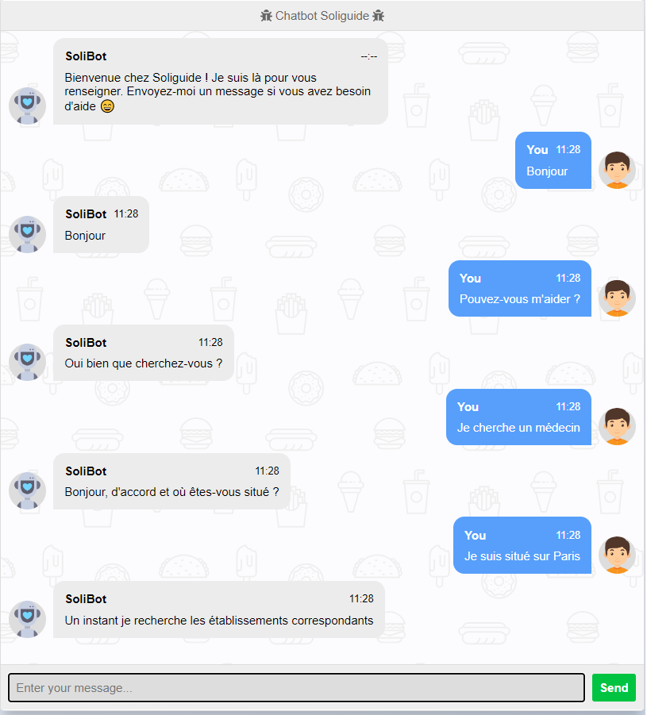

# Project 1.01 - SoliBot : The Chatbot helping people in precarious situations

## The Project Team
- Member : Maxime Zennaro
- Member : Amadou Fofana
- Member : Haonan Lin
- Member : Chiara Roverato
- Member : Denis De Faria

## Table of contents
1. [Project Description](#description-du-projet)
2. [Installation](#installation)
3. [Data sources](#sources-de-donnees)
4. [FAQs](#faqs)

## Project Description

The aim of the project is to create a user-friendly interface via a Chatbot that would allow users to have a certain autonomy while making it easier for them to access their information for people who are not comfortable with the Soliguide browser. This version of Chatbot is based on the concepts of learning and understanding text so that the exchange is freer to keep the mind of the initial chat answered by the members of the association.

The project architecture is based on the processing and development of training data from the Web Scraping and the Soliguide Database. Then we have a part that acts as the body of the Chatbot that allows to run the training files and therefore to train the chatbot. Finally, a web/html interface allows you to converse with SoliBot.

## Project View 

## Data sources : 
- Soliguide Database : [Soliguide Database](https://api.soliguide.fr/search?limit=10000)
- Crisp web site for the chat conversations : [CRISP web site](https://app.crisp.chat/website/6b9552e0-e4cd-404a-905b-215ea25692b0/inbox/session_f45afa7d-4daf-4a7a-8af0-e43591baa027/)

## Installations
[requirements](./requirements.txt)

- pip install pandas
- pip install numpy
- pip install nltk
- pip install chatterbot
- pip install chatterbot-corpus
- pip install sklearn
- pip install sklearn.feature_extraction.text
- pip install spacy
- pip install Flask
- pip install stop_words

or 

`pip install -r requirements.txt`

You will then have to download the 'punkt' tokenizer from the nltk library into a python console or terminal via the command

    nltk.download('punkt')

#### Run the Flask app

Before running the app, you can run the chatbot.py file in order to train your chatbot (it is not necessary for every test but only if you want to update the chatbot training).
Then run the app.py file and you will see your Flask interface running [here](http://127.0.0.1:5000/) 
In your terminal, press CTRL+C to quit.

## Support
- [Git_Project_Link](https://gitlab-cw1.centralesupelec.fr/chiara.roverato/chatbot.git)
- Team : Project 1.01 - Chatbot for helping people in precarious situations
- IDE : VScode and python 3.7+ base conda

## FAQs

The following is a non-exhaustive list of frequently asked questions or errors:

1. **Chatterbot version error**

When you install chatterbot, you may have an error for version 1.0.5

In this case, use:

    pip install chatterbot==1.0.4

3. **Cannot uninstall 'PyYAML'. It is a distutils installed project and thus we cannot accurately determine which files belong to it which would lead to only a partial uninstall**

Use the command line in your terminal 

    pip install --ignore-installed PyYAML

3. **Error time.clock() : AttributeError: module 'time' has no attribute 'clock'**

The problem is this control:

    if win32 or jython:
        time_func = time.clock
    else:
        time_func = time.time

file compat.py (SQLAlchemy library). the control is not correct. it may be:

    if win32 or jython:
    try: # Python 3.4+
        preferred_clock = time.perf_counter
    except AttributeError: # Earlier than Python 3.
        preferred_clock = time.clock
    else:
        time_func = time.time

like sessions.py (requests library)

4. **Error in installing the spacy french corpus**

Try install it :

    python -m spacy download fr_core_news_sm

